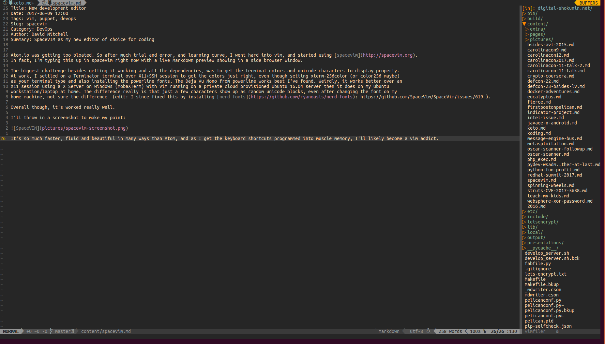

Title: New development editor
Date: 2017-06-09 12:00
Tags: vim, puppet, devops
Slug: spacevim
Category: DevOps
Author: David Mitchell
Summary: SpaceVIM as my new editor of choice for coding

Atom.io was getting too bloated. So after much trial and error, and learning curve, I went hard into vim, and started using [spacevim](http://spacevim.org).
In fact, I'm typing this up in spacevim right now with a live Markdown preview showing in a side browser window.

The biggest challenge besides getting it working and all the dependencies, was to get the terminal colors and unicode characters to display properly.
At work, I settled on a Terminator terminal over X11+SSH session to get the colors just right, even though setting xterm-256color (or color256 maybe)
as your terminal type and also installing the powerline fonts. The Deja Vu Mono from powerline works best I've found. Weirdly, it works better over an
X11 session using a X Server on Windows (MobaXTerm) with vim running on a private cloud provisioned Ubuntu 16.04 server then it does on my Ubuntu
workstation/laptop at home. The difference really is that just a few characters show up as random unicode blocks, even after changing the font on my
home machine, not sure the difference  (edit: I since fixed this by installing [nerd fonts](https://github.com/ryanoasis/nerd-fonts): https://github.com/SpaceVim/SpaceVim/issues/619 ).

Overall though, it's worked really well.

I'll throw in a screenshot to make my point:

It's so much faster, fluid and beautiful in many ways than Atom, and as I get the keyboard shortcuts programmed into muscle memory, I'll likely become a vim addict.
